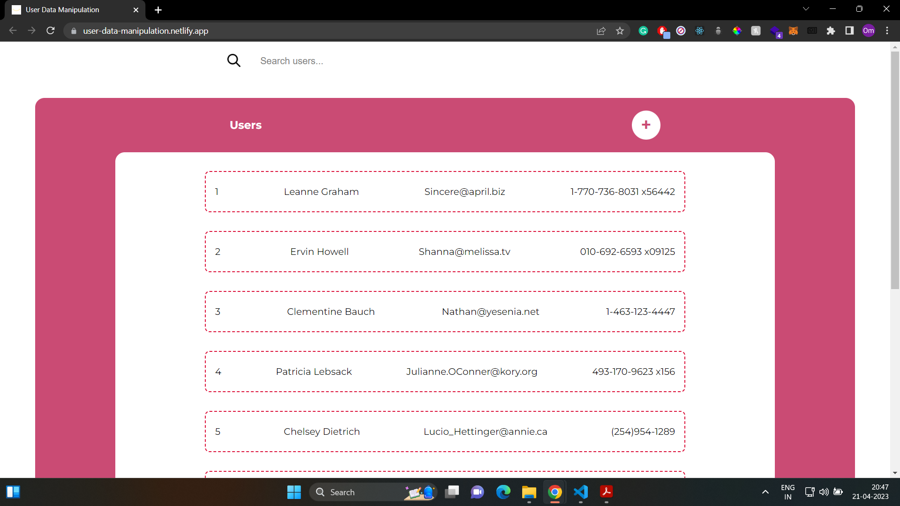
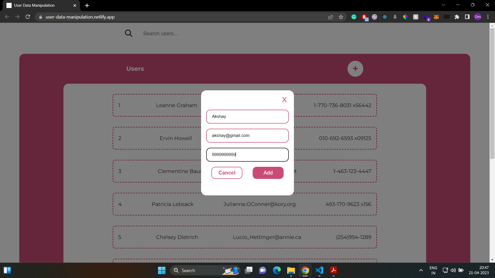
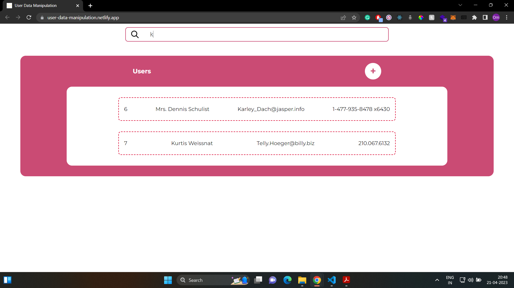

# User Data Manipulation

It is a mini app to check React Component Creation and Data Management.


## Live Project Link

[User Data Manipulation](https://user-data-manipulation.netlify.app/)
## Demo






## Installation

Install user-data-manipulation-main locally with npm

```bash
  npm install user-data-manipulation-main
  cd user-data-manipulation-main
  npm start
```
    
## Tech Stack

**Client:** 
- ReactJS
- JavaScript
- HTML5
- CSS3

## Features

- using publicly available API to fetch user data
- displaying all the users with their basic information
- form that allows users to add new users to the list
- search functionality that allow users to filter the list of users based on name or email address


## Feedback

If you have any feedback, please reach out to us at any of the given socials.


## 🔗 Links

[](https://omgaikwad.netlify.app/)

[](https://www.linkedin.com/in/omgaikwad1/)

[](https://twitter.com/OmGaikwad_)
